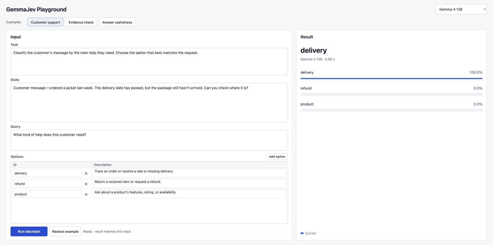

# GemmaJev

A simplified functionality reproduction of [Jev-style decisions](https://docs.typesafe.ai/introduction) with Gemma 4. Finetuning free, runs locally on your machine.

> **Disclaimer** - GemmaJev is NOT a full reproduction of TypeSafe's original Jev; see [Limitations](./README.md#limitations). This project is developed through ~100% vibe coding (powered by Codex w/ GPT-6 Astra). While tested, the code and documentation may contain critical bugs, hallucinations, or inaccuracies. Use at your own risk and verify critical results independently. If you encounter any problem, feel free to open an [issue](../../issues).

> **Contributing** - Any interesting contribution is welcome. Feel free to [PR](../../pulls).

## LLM-to-Jev Solution

**GemmaJev turns a decision problem into a multiple-choice question, reads and normalizes the next-token logits for its option labels.** No CoT or answer text is generated.

```text
Your request
→ assign single-token labels to options
→ fixed prompt
→ model prefill
→ fetch logits of option labels
→ softmax
→ option-ID probabilities
```

### Prompt template and structured I/O

**The model takes a unified prompt template for all decision tasks**:
```text
{task}

Your response must begin immediately with one valid option label.
Output only that label without explanation.

Current state:
{state}

Query:
{query}

Options:
A = {option_id}: {option_description}
B = {option_id}: {option_description}
...
```

**Input fields**:

`task` - A fixed description of the decision task.

`state` - The context or content for the current decision, such as a customer message, supporting evidence, or a proposed answer.

`query` - The specific question to answer or claim to evaluate using the information in `state` and the available options.

`options` - One option is a mapping from a short, meaningful decision term (option_id) to a detailed description (option_description) of the decision. Each option is assigned a single-token label (e.g., A, B, C, ...) for logits decoding.

**A typical input example**:

```json
{
  "task": "Read the evidence and judge the claim using only the evidence provided. Distinguish a contradiction from missing information.",
  "state": "Evidence: The museum opens at 10 a.m. on Sundays. Visitors must book a ticket in advance. Admission is free for children under 12.",
  "query": "Claim: The museum allows pets.",
  "options": {
    "supported": "The evidence supports the claim.",
    "contradicted": "The evidence contradicts the claim.",
    "unknown": "The evidence does not establish whether the claim is true or false."
  }
}
```
> **Notes**: The caller owns the self-consistency of its inputs: if `task` refers to evidence or a claim, those terms should be defined in `state` and `query`, as above. The public API does not require knowledge of internal prompt headings.

**The response is only the probability mapping**:

```json
{
  "supported": 0.01,
  "contradicted": 0.01,
  "unknown": 0.98
}
```

## Benchmark Results

The release preserves **9,176 measured decisions across 13 datasets**, with 4,588 examples per model. Both configurations use the same final interface. Detailed protocols, source revisions and metric definitions are in [Benchmarks](docs/benchmarks.md); the [compact result archive](docs/results/summary.json) can be verified without loading a model.

### Compared with TypeSafe Jev

Each task below contains 200 examples. Jev results are **[published community measurements](https://github.com/OmarMujahid/jev-decision-bench/blob/0883fa781729ab571005253f6b288ec67f49dd29/report.json) of the original TypeSafe API**, not measurements made by this project.

| Task | Metric | TypeSafe Jev | GemmaJev E4B | GemmaJev 12B |
| --- | --- | ---: | ---: | ---: |
| [AG News](https://huggingface.co/datasets/fancyzhx/ag_news) | Acc ↑ | 87.00% | 84.50% | 82.50% |
| [BoolQ](https://huggingface.co/datasets/google/boolq) | Acc ↑ | 91.50% | 85.00% | 89.50% |
| [MMLU](https://huggingface.co/datasets/cais/mmlu) | Acc ↑ | 93.50% | 66.00% | 73.00% |
| [LogiQA](https://huggingface.co/datasets/lucasmccabe/logiqa) | Acc ↑| 76.50% | 34.50% | 49.00% |
| [ANLI R3](https://huggingface.co/datasets/facebook/anli) | Acc ↑| 66.00% | 45.00% | 52.50% |
| [Emotion](https://huggingface.co/datasets/dair-ai/emotion) | Acc ↑ | 50.50% | 49.50% | 47.50% |
| [HelpSteer2](https://huggingface.co/datasets/nvidia/HelpSteer2) | Spearman ↑ | 0.4902 | 0.4686 | 0.5676 |

> Jev's historical inputs were not published. We reconstructed the public selection recipe and documented input repairs, so this is a task-level comparison. [Source and comparison conditions](docs/benchmarks.md#compared-with-typesafe-jev).


**Conclusion** - GemmaJev 12B is competitive on reading judgments and helpfulness ranking, while knowledge and complex reasoning remain substantially behind Jev.

### Compared with other open-source Jev projects

**TL;DR - GemmaJev is a highly competitive LLM-to-Jev solution without task-specific fine-tuning. Using off-the-shelf models and a unified prompt template, it matches or outperforms several existing open-source alternatives on the evaluated benchmarks, even with smaller model size.**

| System and published configuration | Task-specific training | Banking20 F1 ↑| Newsgroups F1 ↑ | Injection F1 ↑ | Typed accuracy ↑ | Typed MAE ↓ |
| --- | --- | ---: | ---: | ---: | ---: | ---: |
| GemmaJev E4B | No | 83.72% | 64.75% | 82.75% | 67.40% | 0.4236 |
| GemmaJev 12B | No | 85.84% | 68.31% | 92.88% | 72.50% | 0.4530 |
| [AnyJev · Qwen2.5-7B-Instruct · raw](https://github.com/nokia-applied-research/AnyJev) | No | 73.77% | 66.99% | 67.46% | 62.05% | 0.4375 |
| [AnyJev · Qwen2.5-7B-Instruct · L1](https://github.com/nokia-applied-research/AnyJev) | No | 78.12% | 71.35% | 77.79% | 63.20% | 0.4427 |
| [AnyJev · Qwen3-32B · L1](https://github.com/nokia-applied-research/AnyJev) | No | — | — | — | 70.05% | 0.4122 |
| [Laya · laya-typed-decisions · fine-tuned](https://huggingface.co/convaiinnovations/laya-typed-decisions) | Yes | — | — | — | 76.80% | 0.2425 |
| [TypeSafe Jev 1.13.0 · reported API](https://docs.typesafe.ai/introduction) | Yes | — | — | — | 72.70% | 0.3910 |


| System | Task-specific training | Authored144 accuracy | WANLI accuracy |
| --- | --- | ---: | ---: |
| GemmaJev E4B | No | 81.94% | 70.14% |
| GemmaJev 12B | No | 95.83% | 75.69% |
| [SemIf · Qwen3.5-4B · direct](https://github.com/TheoLeeCJ/SemIf) | No | 80.56% | 64.58% |
| [SemIf · Qwen3.8-27B-exl3 · direct](https://github.com/TheoLeeCJ/SemIf) | No | 95.83% | — |

> **Task-specific training** indicates additional model-weight training for decision tasks, excluding the base checkpoint's original pretraining and instruction tuning.

## Get Started with GemmaJev

### Environment requirements

The repo is tested on a Macbook Pro with **MacOS, Apple M2 Pro, 16 GB unified memory**, so this release targets Apple Silicon and Metal; other operating systems are outside its supported scope. Contributions on other platform configurations are welcome.

Install [uv](https://docs.astral.sh/uv/getting-started/installation/), [CMake](https://cmake.org/download/) and Xcode Command Line Tools (`xcode-select --install`). Python 3.12 is selected by `.python-version`; the package requires Python 3.11 or newer.

From a source checkout:

```bash
uv sync --locked --extra data
uv run gemmajev setup --model 12b
```

Setup downloads and builds the pinned text-only llama.cpp runtime, then downloads and verifies the selected model. Model downloads are approximately **4.80 GiB for E4B** and **6.50 GiB for 12B**, plus runtime source/build space. Use `--model e4b` for E4B, or `--model all` to prepare both.

| Local directory | Contents |
| --- | --- |
| `.models/` | Verified model weights |
| `.runtime/` | Downloaded source, compiled runtime, logs and fresh benchmark runs |
| `.datasets/` | Downloaded benchmark data and preparation caches |

These directories are ignored by Git. The repository includes code, download manifests and measured-result metadata, not model weights, runtime binaries or dataset passages.

### Demos

```bash
uv run gemmajev demo --model 12b
```

This launches a **GemmaJev Playground** with examples in your browser at `http://127.0.0.1:7860`. You can also edit the fields to test your own cases.



### Python and JSON API

```python
from gemmajev import GemmaJev

request = {
    "task": "Read the evidence and judge the claim using only that evidence.",
    "state": "Evidence: The meeting has been cancelled.",
    "query": "Claim: The meeting is cancelled.",
    "options": {
        "supported": "The evidence supports the claim.",
        "contradicted": "The evidence contradicts the claim.",
        "unknown": "The evidence does not establish either conclusion."
    }
}

with GemmaJev(model="12b") as model:
    probabilities = model.decide(request)
    print(probabilities)
```

The same request can be supplied as a JSON file or via stdin:

```bash
uv run gemmajev decide src/gemmajev/examples/evidence_check.json --model 12b
uv run gemmajev decide - --model 12b < request.json
```

### Benchmark

Recompute all published local scores offline:

```bash
uv run gemmajev benchmark verify
uv run gemmajev benchmark report
```

Download the frozen data selections, run a short check, then run a complete model panel:

```bash
uv run --extra data gemmajev benchmark prepare --dataset all
uv run --extra data gemmajev benchmark run --model 12b --dataset boolq --limit 3
uv run --extra data gemmajev benchmark run --model 12b --dataset all
```

Use `--model e4b` for the other configuration after preparing its weights. `--limit` is a smoke check, not a replacement for the published full panel.
See [Benchmarks](docs/benchmarks.md) for complete commands and reproduction conditions.

### Development

For development, run

```bash
uv run --extra data pytest
uv run ruff check .
```

## Limitations

GemmaJev is inspired by [TypeSafe Jev](https://docs.typesafe.ai/introduction). We credit the TypeSafe team for the original Jev system that motivated this exploration.

- **Simplified decision interface.** GemmaJev does not reproduce Jev's complete `Noul`, `Choice`, and `Score` I/O interfaces. It approximates one aspect of Jev-style decision-making by returning a probability distribution over user-defined options.
- **Research toy.** This project is a research prototype. Production infrastructure and comprehensive inference optimization are outside its scope. Its benchmark results should not be interpreted as equivalence to Jev's complete service.
- Decisions select among 2–26 supplied options. Task wording, option definitions and order can affect results.
- Probabilities are normalized within that option set; they are not calibrated estimates of real-world correctness.
- Knowledge and complex reasoning are clear weaknesses relative to the published Jev reference. Results on these datasets do not establish overall Jev equivalence or reveal its implementation.
- Published scores retain the original measurements. Sampling and prompts are fixed, but runtime builds, cache boundaries and floating-point execution can produce small differences on reruns.
- Local latency depends on input length, model size and cache reuse. Request timing excludes initial model loading and benchmark cooldowns.

## License

GemmaJev is released under the [MIT License](LICENSE). Model weights, datasets and third-party components retain their respective licenses.

## References

- [TypeSafe Jev](https://docs.typesafe.ai/introduction).
- [Google Gemma](https://ai.google.dev/gemma/docs) and its [model terms](https://ai.google.dev/gemma/terms); checkpoint versions and hashes are pinned in [models.toml](src/gemmajev/models.toml).
- [llama.cpp](https://github.com/ggml-org/llama.cpp); see the [text runtime notes](native/README.md) for the pinned revision and required raw-logits patch.
- [AnyJev](https://github.com/nokia-applied-research/AnyJev), [SemIf](https://github.com/TheoLeeCJ/SemIf), and [Laya Typed Decisions](https://huggingface.co/convaiinnovations/laya-typed-decisions).
- [Benchmark data and result provenance](docs/benchmarks.md). Models and datasets retain their upstream licenses.
